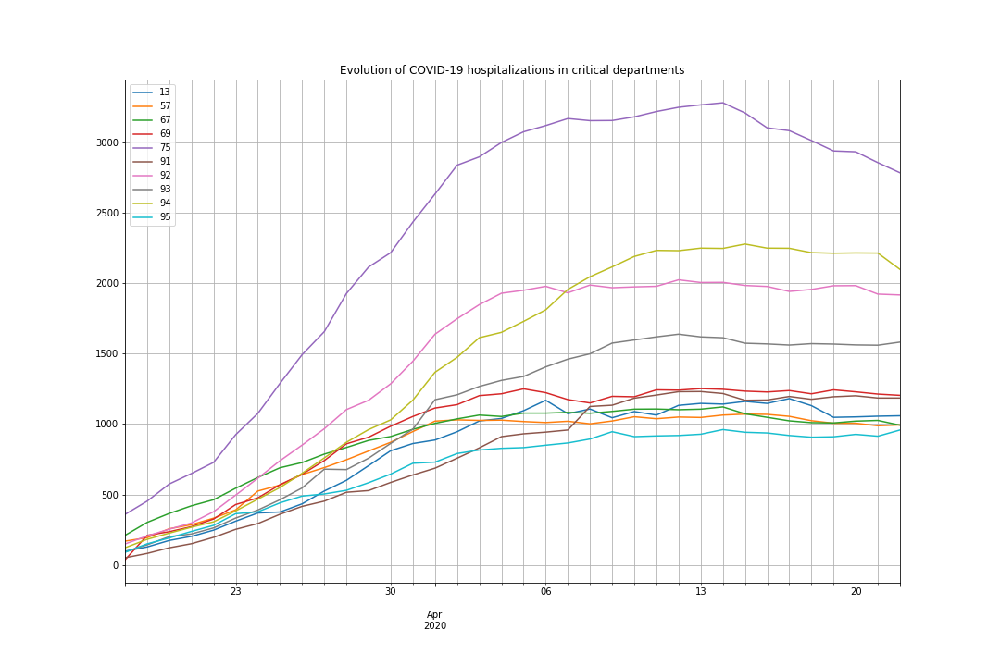

# COVID-19 evolution in French departments (Last update: 22/04/20)

Visualize evolution of the number of people hospitalized in French departments due to COVID-19 infection

COVID-19 and geographical data come from the [French open data portal](https://www.data.gouv.fr/fr/)

Data are stored as [pandas](https://pandas.pydata.org/) / [GeoPandas](http://geopandas.org/) dataframes

The map background is built with [contextily](https://github.com/darribas/contextily)

The final animated gif is built with pillow and matplotlib

Example: Evolution of the number of people hospitalized in French departments due to COVID-19 infection

Example: Evolution of hospitalizations in critical departments

Example: Focus on one French department (31 - Haute-Garonne)

## Running the tests

Run the different notebooks to generate curves and map:

* demo-covid: build the animated gif with the map of France

* demo-stats: basic stats on COVID-19 data

* demo-plot-alldepts: plot evolution curves of most critical departments

* demo-31: plot the curve for a specific department (e.g. 31)

## Built With

* [pandas](https://pandas.pydata.org/) - Python Data Analysis Library

* [GeoPandas](http://geopandas.org/) - GeoPandas is an open source project which extends the datatypes used by pandas to allow spatial operations on geometric types. 

* [contextily](https://github.com/darribas/contextily) - Context geo-tiles in Python

## Versions

Code executed with: Python 3.7.4, geopandas 0.6.1, pyproj 1.9.6 and pillow 6.2.0

If you are using geopandas >= 0.7, you may have to modify CRS settings, see: https://geopandas.org/projections.html#upgrading-to-geopandas-0-7-with-pyproj-2-2-and-proj-6

Create a folder named "img" at the root to save images.

## Authors

* **Thomas Dubot** 

## License

This project is licensed under the MIT License - see the [LICENSE.md](LICENSE.md) file for details

## Acknowledgments

Data are provided by the [French open data portal](https://www.data.gouv.fr/fr/). More information here:

https://www.data.gouv.fr/fr/datasets/donnees-relatives-a-lepidemie-du-covid-19/

https://www.data.gouv.fr/fr/datasets/contours-des-departements-francais-issus-d-openstreetmap/