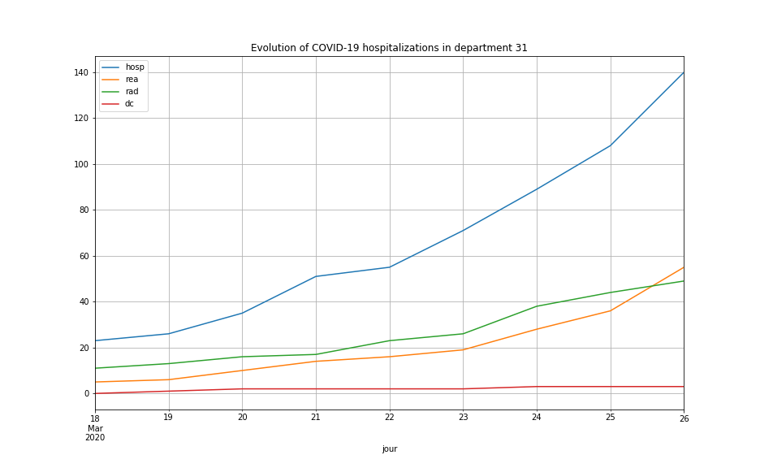

# COVID-19 evolution in French departments (Last update: 27/03/20)

Visualize evolution of the number of people hospitalized in French departments due to COVID-19 infection

COVID-19 and geographical data come from the [French open data portal](https://www.data.gouv.fr/fr/)

Data are stored as [pandas](https://pandas.pydata.org/) / [GeoPandas](http://geopandas.org/) dataframes

The map background is built with [contextily](https://github.com/darribas/contextily)

The final animated gif is built with PIL and matplotlib

Example: Evolution of the number of people hospitalized in French departments due to COVID-19 infection

Example: Focus on one French department (31 - Haute-Garonne)

## Running the tests

Run the demo-covid notebook to see how to build dataframes and visualize data on maps

## Built With

* [pandas](https://pandas.pydata.org/) - Python Data Analysis Library

* [GeoPandas](http://geopandas.org/) - GeoPandas is an open source project which extends the datatypes used by pandas to allow spatial operations on geometric types. 

* [contextily](https://github.com/darribas/contextily) - Context geo-tiles in Python

## Authors

* **Thomas Dubot** 

## License

This project is licensed under the MIT License - see the [LICENSE.md](LICENSE.md) file for details

## Acknowledgments

Data are provided by the [French open data portal](https://www.data.gouv.fr/fr/). More information here:

https://www.data.gouv.fr/fr/datasets/donnees-relatives-a-lepidemie-du-covid-19/

https://www.data.gouv.fr/fr/datasets/contours-des-departements-francais-issus-d-openstreetmap/